# Study Vault Architecture And UML Documentation

Study Vault is an offline-first Electron study planner for imported course material. It turns PDFs, Markdown, JSON, and text into structured course sections, study tasks, auto-planned study blocks, quiz practice, and progress analytics.

The core product idea is:

- Courses store the source learning material.
- Topics are the studyable sections extracted from that material.
- Tasks are the actionable work created from topics.
- The planner turns due dates into do dates by fitting tasks into available study windows.
- Study logs, completions, and quiz attempts become stats.
- Ollama is used locally for quiz generation and study analysis.

## How To Read This Document

This document uses Mermaid diagrams because GitHub renders Mermaid directly in Markdown. The diagrams are grouped by UML purpose:

- System and component diagrams show the high-level structure.
- Use case and user journey diagrams show what the student can do.
- Activity diagrams show business workflows.
- Sequence diagrams show runtime message flow.
- Class diagrams show the data model.
- State diagrams show lifecycle changes.
- Deployment diagrams show where the app runs.

## System Overview Diagram

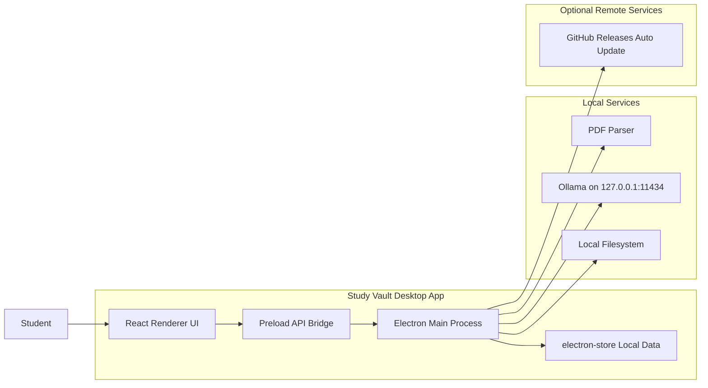
```mermaid
flowchart LR
  Student["Student"]

  subgraph DesktopApp["Study Vault Desktop App"]
    Renderer["React Renderer UI"]
    Preload["Preload API Bridge"]
    Main["Electron Main Process"]
    Store["electron-store Local Data"]
  end

  subgraph LocalServices["Local Services"]
    PDF["PDF Parser"]
    Ollama["Ollama on 127.0.0.1:11434"]
    Files["Local Filesystem"]
  end

  subgraph RemoteServices["Optional Remote Services"]
    Releases["GitHub Releases Auto Update"]
  end

  Student --> Renderer
  Renderer --> Preload
  Preload --> Main
  Main --> Store
  Main --> PDF
  Main --> Ollama
  Main --> Files
  Main --> Releases
```

The renderer owns the visible app. The preload file exposes a safe `window.api` bridge. The main process handles file dialogs, storage, PDF parsing, local AI calls, updater checks, and all database-like actions.

## Component Diagram

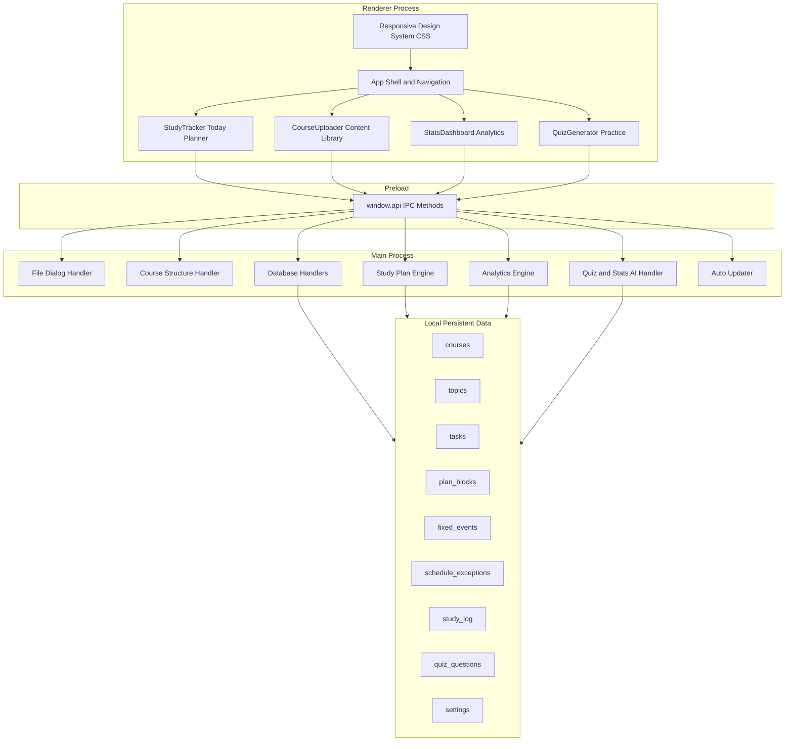
```mermaid
flowchart TB
  subgraph Renderer["Renderer Process"]
    App["App Shell and Navigation"]
    Today["StudyTracker Today Planner"]
    Courses["CourseUploader Content Library"]
    Stats["StatsDashboard Analytics"]
    Quiz["QuizGenerator Practice"]
    Styles["Responsive Design System CSS"]
  end

  subgraph Bridge["Preload"]
    API["window.api IPC Methods"]
  end

  subgraph Main["Main Process"]
    Dialog["File Dialog Handler"]
    CourseAI["Course Structure Handler"]
    DataHandlers["Database Handlers"]
    Planner["Study Plan Engine"]
    Analytics["Analytics Engine"]
    QuizAI["Quiz and Stats AI Handler"]
    Updater["Auto Updater"]
  end

  subgraph Data["Local Persistent Data"]
    CoursesData["courses"]
    TopicsData["topics"]
    TasksData["tasks"]
    BlocksData["plan_blocks"]
    EventsData["fixed_events"]
    ExceptionsData["schedule_exceptions"]
    LogsData["study_log"]
    QuizData["quiz_questions"]
    SettingsData["settings"]
  end

  App --> Today
  App --> Courses
  App --> Stats
  App --> Quiz
  Today --> API
  Courses --> API
  Stats --> API
  Quiz --> API
  API --> Dialog
  API --> CourseAI
  API --> DataHandlers
  API --> Planner
  API --> Analytics
  API --> QuizAI
  API --> Updater
  DataHandlers --> Data
  Planner --> Data
  Analytics --> Data
  QuizAI --> Data
  Styles --> App
```

The important separation is that pages do not talk directly to storage. All persistent actions go through IPC, which keeps the Electron security boundary clear.

## Use Case Diagram

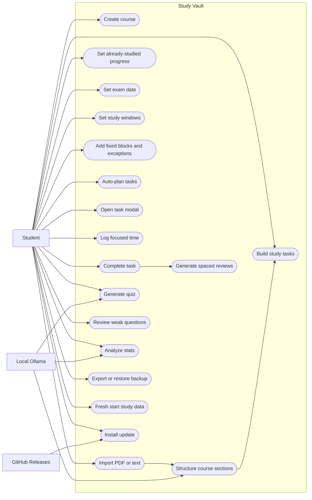
```mermaid
flowchart LR
  Student["Student"]
  Ollama["Local Ollama"]
  GitHub["GitHub Releases"]

  subgraph StudyVault["Study Vault"]
    UC1(["Create course"])
    UC2(["Import PDF or text"])
    UC3(["Structure course sections"])
    UC4(["Set already-studied progress"])
    UC5(["Build study tasks"])
    UC6(["Set exam date"])
    UC7(["Set study windows"])
    UC8(["Add fixed blocks and exceptions"])
    UC9(["Auto-plan tasks"])
    UC10(["Open task modal"])
    UC11(["Log focused time"])
    UC12(["Complete task"])
    UC13(["Generate spaced reviews"])
    UC14(["Generate quiz"])
    UC15(["Review weak questions"])
    UC16(["Analyze stats"])
    UC17(["Export or restore backup"])
    UC18(["Fresh start study data"])
    UC19(["Install update"])
  end

  Student --> UC1
  Student --> UC2
  Student --> UC4
  Student --> UC5
  Student --> UC6
  Student --> UC7
  Student --> UC8
  Student --> UC9
  Student --> UC10
  Student --> UC11
  Student --> UC12
  Student --> UC14
  Student --> UC15
  Student --> UC16
  Student --> UC17
  Student --> UC18
  Student --> UC19

  UC2 --> UC3
  UC3 --> UC5
  UC12 --> UC13
  Ollama --> UC3
  Ollama --> UC14
  Ollama --> UC16
  GitHub --> UC19
```

The student is the primary actor. Ollama is a supporting local actor for AI features. GitHub Releases is optional and only matters after packaging and publishing releases.

## User Journey Diagram

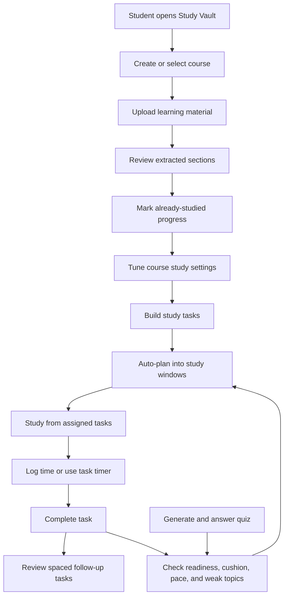
```mermaid
flowchart TD
  Start["Student opens Study Vault"]
  Course["Create or select course"]
  Import["Upload learning material"]
  ReviewSections["Review extracted sections"]
  Progress["Mark already-studied progress"]
  Settings["Tune course study settings"]
  Build["Build study tasks"]
  Plan["Auto-plan into study windows"]
  Study["Study from assigned tasks"]
  Log["Log time or use task timer"]
  Complete["Complete task"]
  Review["Review spaced follow-up tasks"]
  Quiz["Generate and answer quiz"]
  Stats["Check readiness, cushion, pace, and weak topics"]

  Start --> Course --> Import --> ReviewSections --> Progress --> Settings --> Build --> Plan --> Study --> Log --> Complete
  Complete --> Review
  Complete --> Stats
  Quiz --> Stats
  Stats --> Plan
```

This is the daily mental model: import once, plan often, study from today, log honestly, and let stats explain what is falling behind.

## Activity Diagram: Course Import To Study Tasks

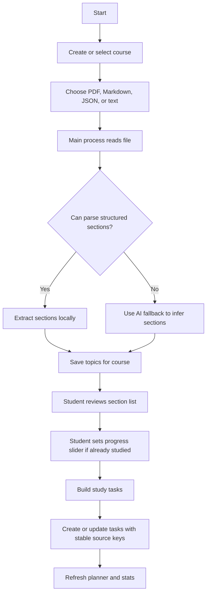
```mermaid
flowchart TD
  A["Start"]
  B["Create or select course"]
  C["Choose PDF, Markdown, JSON, or text"]
  D["Main process reads file"]
  E{"Can parse structured sections?"}
  F["Extract sections locally"]
  G["Use AI fallback to infer sections"]
  H["Save topics for course"]
  I["Student reviews section list"]
  J["Student sets progress slider if already studied"]
  K["Build study tasks"]
  L["Create or update tasks with stable source keys"]
  M["Refresh planner and stats"]

  A --> B --> C --> D --> E
  E -->|Yes| F
  E -->|No| G
  F --> H
  G --> H
  H --> I --> J --> K --> L --> M
```

The critical design choice is idempotent task creation. Topic-derived tasks use stable source keys so rebuilding tasks does not create a junk pile of duplicates.

## Activity Diagram: Capacity-Aware Planning

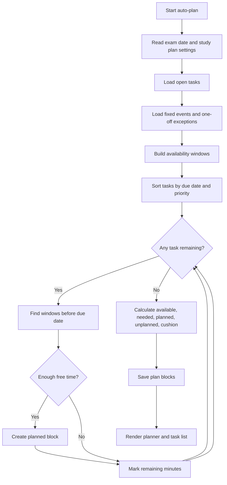
```mermaid
flowchart TD
  A["Start auto-plan"]
  B["Read exam date and study plan settings"]
  C["Load open tasks"]
  D["Load fixed events and one-off exceptions"]
  E["Build availability windows"]
  F["Sort tasks by due date and priority"]
  G{"Any task remaining?"}
  H["Find windows before due date"]
  I{"Enough free time?"}
  J["Create planned block"]
  K["Mark remaining minutes"]
  L["Calculate available, needed, planned, unplanned, cushion"]
  M["Save plan blocks"]
  N["Render planner and task list"]

  A --> B --> C --> D --> E --> F --> G
  G -->|Yes| H --> I
  I -->|Yes| J --> K --> G
  I -->|No| K --> G
  G -->|No| L --> M --> N
```

The planner is a computed view over tasks and schedule constraints. Fixed blocks and exceptions reduce available time before the app assigns study blocks.

## Activity Diagram: Task Study Loop

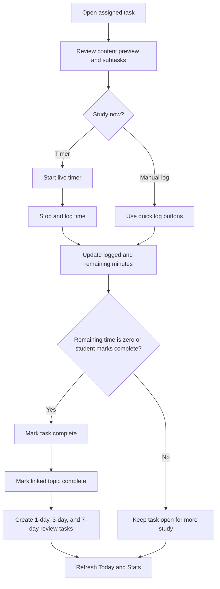
```mermaid
flowchart TD
  A["Open assigned task"]
  B["Review content preview and subtasks"]
  C{"Study now?"}
  D["Start live timer"]
  E["Stop and log time"]
  F["Use quick log buttons"]
  G["Update logged and remaining minutes"]
  H{"Remaining time is zero or student marks complete?"}
  I["Mark task complete"]
  J["Mark linked topic complete"]
  K["Create 1-day, 3-day, and 7-day review tasks"]
  L["Refresh Today and Stats"]
  M["Keep task open for more study"]

  A --> B --> C
  C -->|Timer| D --> E --> G
  C -->|Manual log| F --> G
  G --> H
  H -->|Yes| I --> J --> K --> L
  H -->|No| M --> L
```

This loop is where the app learns real study effort. The more task-linked logs exist, the better the estimate calibration and stats become.

## Activity Diagram: Quiz Review Loop

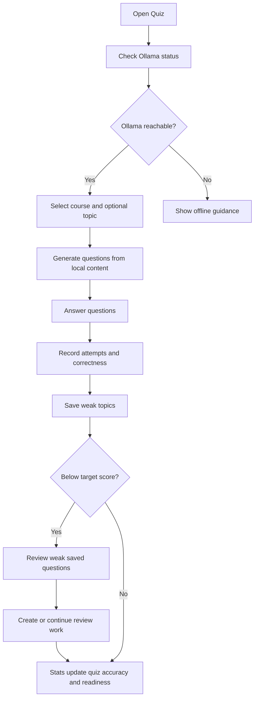
```mermaid
flowchart TD
  A["Open Quiz"]
  B["Check Ollama status"]
  C{"Ollama reachable?"}
  D["Select course and optional topic"]
  E["Generate questions from local content"]
  F["Answer questions"]
  G["Record attempts and correctness"]
  H["Save weak topics"]
  I{"Below target score?"}
  J["Review weak saved questions"]
  K["Create or continue review work"]
  L["Stats update quiz accuracy and readiness"]
  M["Show offline guidance"]

  A --> B --> C
  C -->|Yes| D --> E --> F --> G --> H --> I
  I -->|Yes| J --> K --> L
  I -->|No| L
  C -->|No| M
```

Quiz data feeds readiness. If no quiz attempts exist yet, the app estimates quiz readiness from section progress until real answers are collected.

## Sequence Diagram: Import PDF And Build Tasks

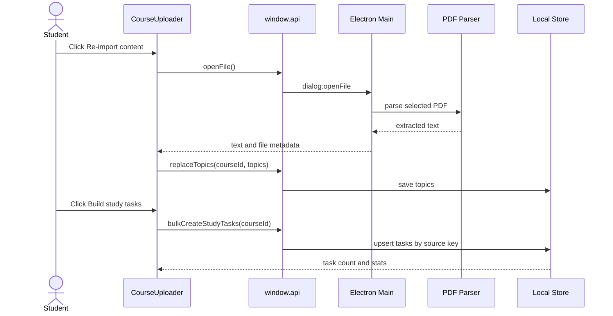
```mermaid
sequenceDiagram
  actor Student
  participant CoursesUI as CourseUploader
  participant API as window.api
  participant Main as Electron Main
  participant Parser as PDF Parser
  participant DB as Local Store

  Student->>CoursesUI: Click Re-import content
  CoursesUI->>API: openFile()
  API->>Main: dialog:openFile
  Main->>Parser: parse selected PDF
  Parser-->>Main: extracted text
  Main-->>CoursesUI: text and file metadata
  CoursesUI->>API: replaceTopics(courseId, topics)
  API->>DB: save topics
  Student->>CoursesUI: Click Build study tasks
  CoursesUI->>API: bulkCreateStudyTasks(courseId)
  API->>DB: upsert tasks by source key
  DB-->>CoursesUI: task count and stats
```

## Sequence Diagram: Auto-Plan And Complete Task

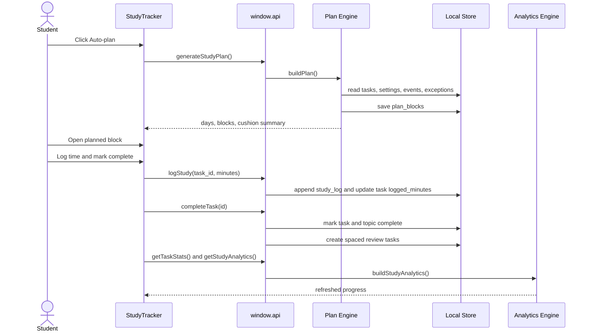
```mermaid
sequenceDiagram
  actor Student
  participant TodayUI as StudyTracker
  participant API as window.api
  participant Planner as Plan Engine
  participant DB as Local Store
  participant Stats as Analytics Engine

  Student->>TodayUI: Click Auto-plan
  TodayUI->>API: generateStudyPlan()
  API->>Planner: buildPlan()
  Planner->>DB: read tasks, settings, events, exceptions
  Planner->>DB: save plan_blocks
  Planner-->>TodayUI: days, blocks, cushion summary
  Student->>TodayUI: Open planned block
  Student->>TodayUI: Log time and mark complete
  TodayUI->>API: logStudy(task_id, minutes)
  API->>DB: append study_log and update task logged_minutes
  TodayUI->>API: completeTask(id)
  API->>DB: mark task and topic complete
  API->>DB: create spaced review tasks
  TodayUI->>API: getTaskStats() and getStudyAnalytics()
  API->>Stats: buildStudyAnalytics()
  Stats-->>TodayUI: refreshed progress
```

## Sequence Diagram: Generate Quiz With Ollama

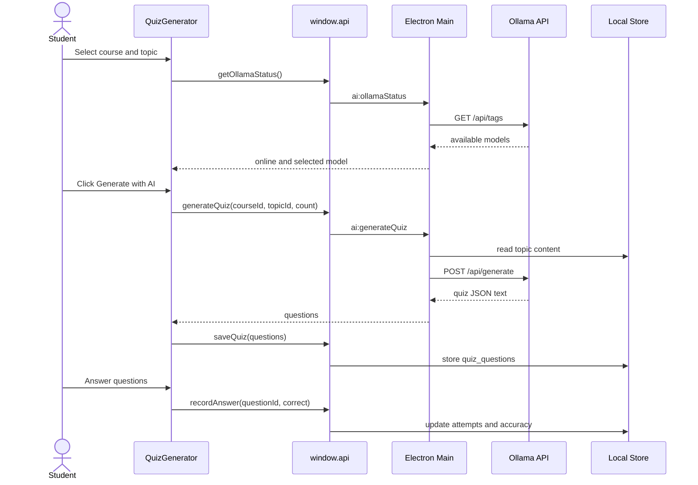
```mermaid
sequenceDiagram
  actor Student
  participant QuizUI as QuizGenerator
  participant API as window.api
  participant Main as Electron Main
  participant Ollama as Ollama API
  participant DB as Local Store

  Student->>QuizUI: Select course and topic
  QuizUI->>API: getOllamaStatus()
  API->>Main: ai:ollamaStatus
  Main->>Ollama: GET /api/tags
  Ollama-->>Main: available models
  Main-->>QuizUI: online and selected model
  Student->>QuizUI: Click Generate with AI
  QuizUI->>API: generateQuiz(courseId, topicId, count)
  API->>Main: ai:generateQuiz
  Main->>DB: read topic content
  Main->>Ollama: POST /api/generate
  Ollama-->>Main: quiz JSON text
  Main-->>QuizUI: questions
  QuizUI->>API: saveQuiz(questions)
  API->>DB: store quiz_questions
  Student->>QuizUI: Answer questions
  QuizUI->>API: recordAnswer(questionId, correct)
  API->>DB: update attempts and accuracy
```

## Sequence Diagram: Backup And Restore

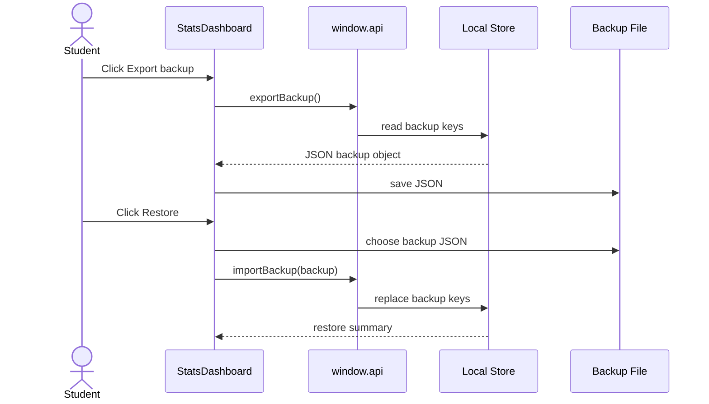
```mermaid
sequenceDiagram
  actor Student
  participant StatsUI as StatsDashboard
  participant API as window.api
  participant DB as Local Store
  participant File as Backup File

  Student->>StatsUI: Click Export backup
  StatsUI->>API: exportBackup()
  API->>DB: read backup keys
  DB-->>StatsUI: JSON backup object
  StatsUI->>File: save JSON
  Student->>StatsUI: Click Restore
  StatsUI->>File: choose backup JSON
  StatsUI->>API: importBackup(backup)
  API->>DB: replace backup keys
  DB-->>StatsUI: restore summary
```

## Class Diagram: Core Data Model

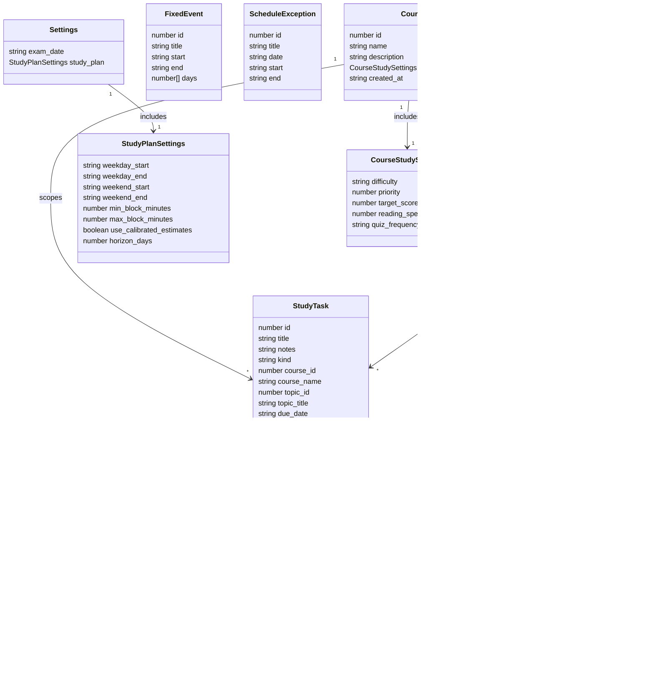
```mermaid
classDiagram
  class Course {
    number id
    string name
    string description
    CourseStudySettings study_settings
    string created_at
  }

  class Topic {
    number id
    number course_id
    string title
    string content
    number order
    number completed
    string created_at
  }

  class StudyTask {
    number id
    string title
    string notes
    string kind
    number course_id
    string course_name
    number topic_id
    string topic_title
    string due_date
    string source_key
    number priority
    number estimate_minutes
    number logged_minutes
    number remaining_minutes
    number completed
    string completed_at
    Subtask[] subtasks
  }

  class Subtask {
    string id
    string title
    number completed
  }

  class PlanBlock {
    number id
    number task_id
    string date
    number start_minute
    number end_minute
    string title
    string course_name
  }

  class StudyLog {
    number id
    string date
    number hours
    number minutes
    number course_id
    number task_id
    string note
    string created_at
  }

  class QuizQuestion {
    number id
    number course_id
    number topic_id
    string question
    string[] choices
    string answer
    string explanation
    number times_attempted
    number times_correct
    string created_at
  }

  class FixedEvent {
    number id
    string title
    string start
    string end
    number[] days
  }

  class ScheduleException {
    number id
    string title
    string date
    string start
    string end
  }

  class Settings {
    string exam_date
    StudyPlanSettings study_plan
  }

  class StudyPlanSettings {
    string weekday_start
    string weekday_end
    string weekend_start
    string weekend_end
    number min_block_minutes
    number max_block_minutes
    boolean use_calibrated_estimates
    number horizon_days
  }

  class CourseStudySettings {
    string difficulty
    number priority
    number target_score
    number reading_speed
    string quiz_frequency
  }

  Course "1" --> "*" Topic : owns
  Course "1" --> "*" StudyTask : scopes
  Topic "1" --> "*" StudyTask : generates
  StudyTask "1" --> "*" Subtask : contains
  StudyTask "1" --> "*" PlanBlock : scheduled_as
  StudyTask "1" --> "*" StudyLog : receives_time
  Topic "1" --> "*" QuizQuestion : practices
  Course "1" --> "*" QuizQuestion : contains
  Settings "1" --> "1" StudyPlanSettings : includes
  Course "1" --> "1" CourseStudySettings : includes
```

## State Diagram: Study Task Lifecycle

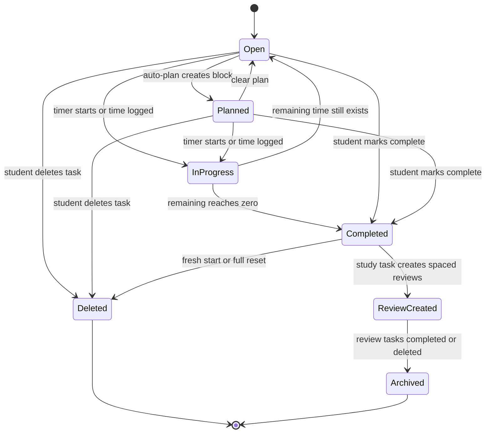
```mermaid
stateDiagram-v2
  [*] --> Open
  Open --> Planned: auto-plan creates block
  Planned --> Open: clear plan
  Open --> InProgress: timer starts or time logged
  Planned --> InProgress: timer starts or time logged
  InProgress --> Open: remaining time still exists
  InProgress --> Completed: remaining reaches zero
  Open --> Completed: student marks complete
  Planned --> Completed: student marks complete
  Completed --> ReviewCreated: study task creates spaced reviews
  ReviewCreated --> Archived: review tasks completed or deleted
  Open --> Deleted: student deletes task
  Planned --> Deleted: student deletes task
  Completed --> Deleted: fresh start or full reset
  Deleted --> [*]
  Archived --> [*]
```

The task can be visible as open, planned, overdue, done, or deleted depending on date, completion, and filters. Plan blocks are disposable; tasks are the durable work item.

## State Diagram: Course Content Lifecycle

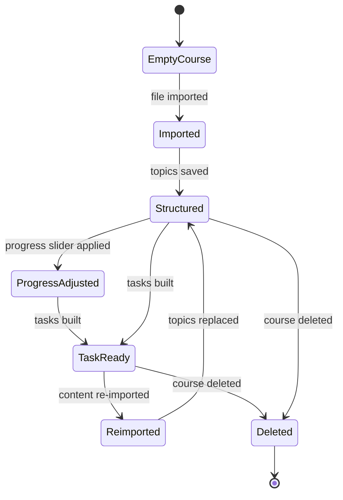
```mermaid
stateDiagram-v2
  [*] --> EmptyCourse
  EmptyCourse --> Imported: file imported
  Imported --> Structured: topics saved
  Structured --> ProgressAdjusted: progress slider applied
  ProgressAdjusted --> TaskReady: tasks built
  Structured --> TaskReady: tasks built
  TaskReady --> Reimported: content re-imported
  Reimported --> Structured: topics replaced
  TaskReady --> Deleted: course deleted
  Structured --> Deleted: course deleted
  Deleted --> [*]
```

Course content and study tasks are intentionally separate. Reimporting content changes topics, while deleting course tasks can reset actionable work without deleting the course itself.

## Deployment Diagram

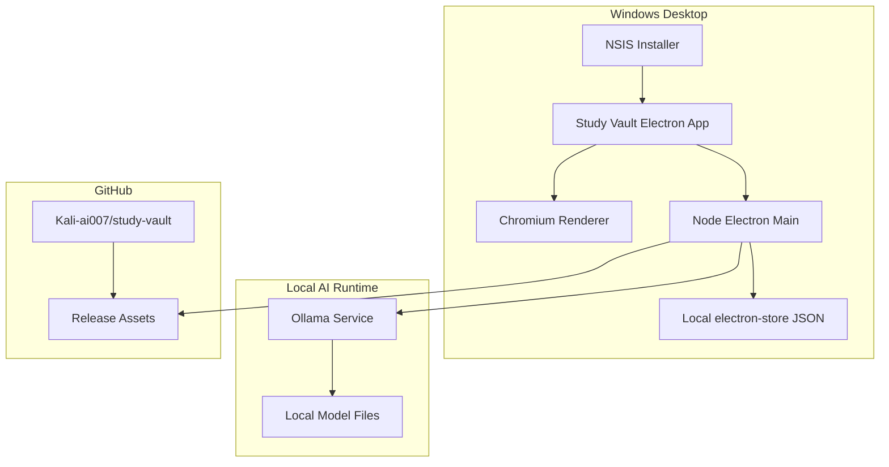
```mermaid
flowchart TB
  subgraph Windows["Windows Desktop"]
    AppExe["Study Vault Electron App"]
    Renderer["Chromium Renderer"]
    Main["Node Electron Main"]
    DataFile["Local electron-store JSON"]
    Installer["NSIS Installer"]
  end

  subgraph LocalAI["Local AI Runtime"]
    OllamaService["Ollama Service"]
    Models["Local Model Files"]
  end

  subgraph GitHub["GitHub"]
    Repo["Kali-ai007/study-vault"]
    ReleaseAssets["Release Assets"]
  end

  AppExe --> Renderer
  AppExe --> Main
  Main --> DataFile
  Main --> OllamaService
  OllamaService --> Models
  Main --> ReleaseAssets
  Repo --> ReleaseAssets
  Installer --> AppExe
```

Study Vault works without the internet for core planning, course data, logs, and quiz usage if Ollama and the model are already installed. Updates need GitHub release assets.

## Data Flow Diagram: Stats And AI Analysis

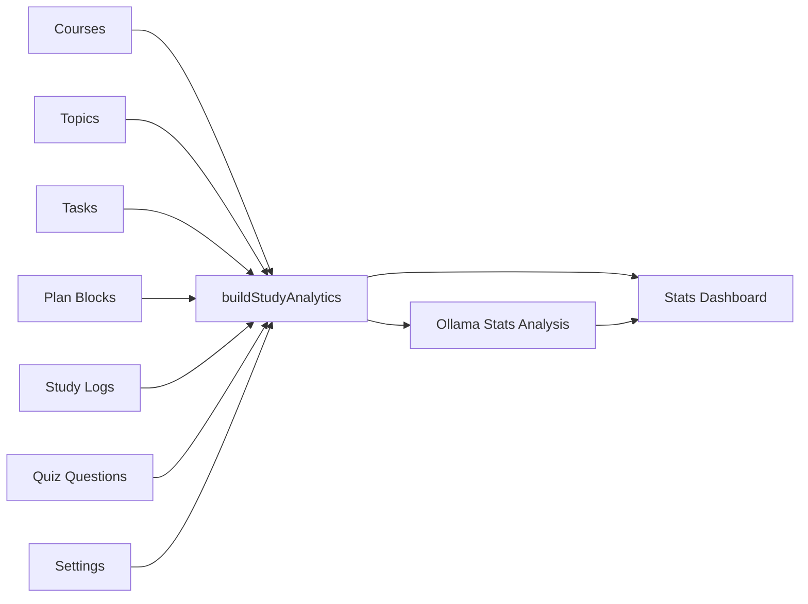
```mermaid
flowchart LR
  Courses["Courses"]
  Topics["Topics"]
  Tasks["Tasks"]
  Plan["Plan Blocks"]
  Logs["Study Logs"]
  Quiz["Quiz Questions"]
  Settings["Settings"]

  Analytics["buildStudyAnalytics"]
  StatsUI["Stats Dashboard"]
  AI["Ollama Stats Analysis"]

  Courses --> Analytics
  Topics --> Analytics
  Tasks --> Analytics
  Plan --> Analytics
  Logs --> Analytics
  Quiz --> Analytics
  Settings --> Analytics
  Analytics --> StatsUI
  Analytics --> AI
  AI --> StatsUI
```

Stats are not just charts. They are a computed layer over progress, workload, logged time, quiz accuracy, completion timing, estimate calibration, and schedule cushion.

## Data Flow Diagram: Planner Inputs And Outputs

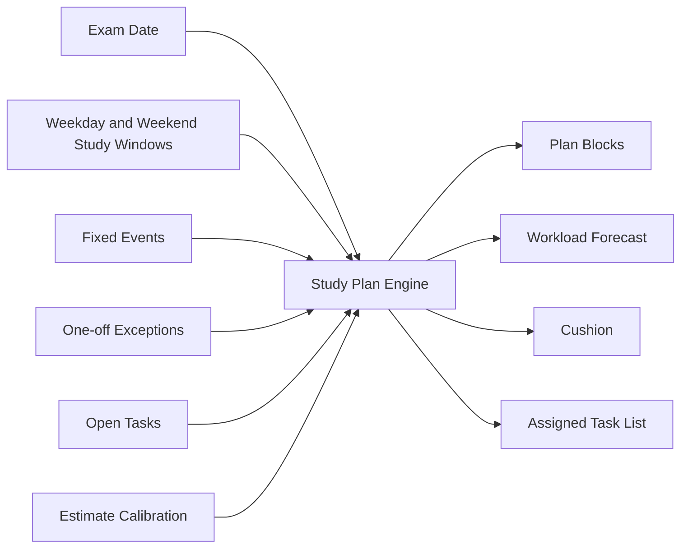
```mermaid
flowchart LR
  Exam["Exam Date"]
  Windows["Weekday and Weekend Study Windows"]
  Fixed["Fixed Events"]
  Exceptions["One-off Exceptions"]
  Tasks["Open Tasks"]
  Calibration["Estimate Calibration"]

  Engine["Study Plan Engine"]

  Blocks["Plan Blocks"]
  Forecast["Workload Forecast"]
  Cushion["Cushion"]
  TaskList["Assigned Task List"]

  Exam --> Engine
  Windows --> Engine
  Fixed --> Engine
  Exceptions --> Engine
  Tasks --> Engine
  Calibration --> Engine
  Engine --> Blocks
  Engine --> Forecast
  Engine --> Cushion
  Engine --> TaskList
```

This is why changing the exam date or fixed schedule matters: it changes the available capacity and can move the app from comfortable to overloaded.

## Screen Map

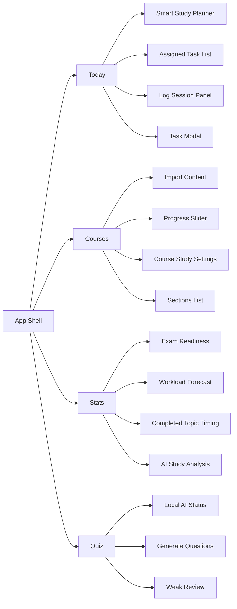
```mermaid
flowchart LR
  Shell["App Shell"]
  Today["Today"]
  Courses["Courses"]
  Stats["Stats"]
  Quiz["Quiz"]

  Shell --> Today
  Shell --> Courses
  Shell --> Stats
  Shell --> Quiz

  Today --> Planner["Smart Study Planner"]
  Today --> TaskList["Assigned Task List"]
  Today --> LogPanel["Log Session Panel"]
  Today --> TaskModal["Task Modal"]

  Courses --> Import["Import Content"]
  Courses --> Progress["Progress Slider"]
  Courses --> Settings["Course Study Settings"]
  Courses --> Sections["Sections List"]

  Stats --> Readiness["Exam Readiness"]
  Stats --> Forecast["Workload Forecast"]
  Stats --> Timing["Completed Topic Timing"]
  Stats --> AIStats["AI Study Analysis"]

  Quiz --> OllamaStatus["Local AI Status"]
  Quiz --> Generate["Generate Questions"]
  Quiz --> WeakReview["Weak Review"]
```

## File Map

| File | Purpose |
| --- | --- |
| `src/main/index.js` | Creates the Electron window, registers file/AI/update handlers, and starts the app. |
| `src/main/database.js` | Local data layer, planner engine, analytics engine, task lifecycle, backups, and IPC database handlers. |
| `src/preload/index.js` | Exposes the secure `window.api` bridge used by React. |
| `src/renderer/src/App.jsx` | Main shell, sidebar navigation, exam days display, update status. |
| `src/renderer/src/components/StudyTracker.jsx` | Today screen, quick add, auto-plan, fixed blocks, exceptions, task list, task modal, logging. |
| `src/renderer/src/components/CourseUploader.jsx` | Course creation, import, section management, progress slider, course settings, study task preview. |
| `src/renderer/src/components/StatsDashboard.jsx` | Readiness, workload, cushion, study hours, calibration, AI stats, backup and reset actions. |
| `src/renderer/src/components/QuizGenerator.jsx` | Ollama status, topic quiz generation, saved questions, weak review loop. |
| `src/renderer/src/index.css` | Light visual system, typography, cards, buttons, responsive behavior, planner layout. |
| `scripts/e2e-smoke.cjs` | End-to-end UI smoke test for the real app. |
| `scripts/pdf-import-smoke.cjs` | Real PDF import smoke test. |
| `scripts/ai-smoke.cjs` | Ollama connectivity and AI feature smoke test. |
| `scripts/backup-smoke.cjs` | Backup and restore sanity test. |

## IPC API Surface

The renderer calls these through `window.api`:

- Course and content: `getCourses`, `createCourse`, `updateCourse`, `deleteCourse`, `openFile`, `structureCourse`, `getTopics`, `insertTopics`, `replaceTopics`, `toggleTopic`, `setCourseProgress`.
- Tasks: `getTasks`, `createTask`, `bulkCreateStudyTasks`, `updateTask`, `completeTask`, `deleteTask`, `deleteAllTasks`, `deleteCourseTasks`.
- Planner: `getStudyPlan`, `generateStudyPlan`, `clearStudyPlan`, `getStudyPlanSettings`, `setStudyPlanSettings`, fixed events, schedule exceptions.
- Study logs and stats: `logStudy`, `getStudyLog`, `getTotalHours`, `getTaskStats`, `getStudyAnalytics`.
- Quiz and AI: `getOllamaStatus`, `generateQuiz`, `saveQuiz`, `getQuiz`, `recordAnswer`, `analyzeStudyStats`.
- Settings and maintenance: `getSetting`, `setSetting`, `clearStudyLogs`, `clearQuizHistory`, `resetSectionProgress`, `freshStartStudy`, `exportBackup`, `importBackup`.
- Updates: `checkUpdate`, `installUpdate`, `onUpdateStatus`.

## Planning Rules

The planner follows these rules:

1. Read open tasks and ignore completed topic-derived tasks.
2. Build a study window for each day in the horizon.
3. Subtract fixed events and one-off exceptions from available time.
4. Sort work by due date and priority.
5. Split tasks into blocks between `min_block_minutes` and `max_block_minutes`.
6. Prefer assigning work before the due date.
7. Compute total available, needed, planned, unplanned, and cushion.
8. Save plan blocks as disposable output.

This means tasks are durable, while plan blocks can be cleared and regenerated safely.

## Fresh Start And Reset Semantics

| Action | Clears | Keeps |
| --- | --- | --- |
| Clear tasks | Tasks and plan blocks | Courses, topics, logs, quiz history, settings |
| Clear logs | Study logs | Courses, topics, tasks, quiz history, settings |
| Reset progress | Topic completion and task completion | Courses, topics, task definitions, logs, quiz history |
| Full reset | Tasks, logs, quiz history, plan blocks, section completion | Courses, imported content, exam date, fixed events, exceptions |
| Delete course tasks | Tasks for one course | Course, topics, logs, global settings |
| Delete course | Course, topics, related tasks, related plan blocks | Other courses and global settings |

## Testing And QA Flow

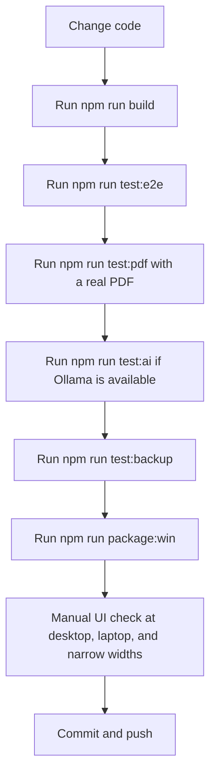
```mermaid
flowchart TD
  A["Change code"]
  B["Run npm run build"]
  C["Run npm run test:e2e"]
  D["Run npm run test:pdf with a real PDF"]
  E["Run npm run test:ai if Ollama is available"]
  F["Run npm run test:backup"]
  G["Run npm run package:win"]
  H["Manual UI check at desktop, laptop, and narrow widths"]
  I["Commit and push"]

  A --> B --> C --> D --> E --> F --> G --> H --> I
```

The E2E smoke test verifies the main flow: create course, import sample content, build study tasks, auto-plan, open a task, log time, complete a task, and check Stats and Quiz. Manual QA is still useful for visual polish because responsive layout issues are often easier to see than assert.

## Current Limitations And Future Work

- Dependency audit still reports vulnerabilities that require breaking major upgrades.
- The Windows installer is unsigned, so Windows can show an unknown-publisher warning.
- Auto-update requires published GitHub release assets.
- Ollama features require the local Ollama service and at least one model.
- Stats become smarter after linked study logs and quiz attempts exist; early stats are partly estimated.
- More visual QA can still improve button consistency, spacing density, modal hierarchy, and tiny text on large screens.

## Summary

Study Vault is best understood as a local academic workload engine:

1. Course content becomes topics.
2. Topics become tasks.
3. Tasks become scheduled study blocks.
4. Logs and completions become stats.
5. Quiz attempts and weak topics improve readiness.
6. The planner keeps recalculating around exam date, real availability, fixed commitments, exceptions, and progress.

That makes it more than a to-do list. It is a study system that tries to answer the student question that generic task apps do not answer: "Can I realistically finish this before the exam, and what should I do today?"
